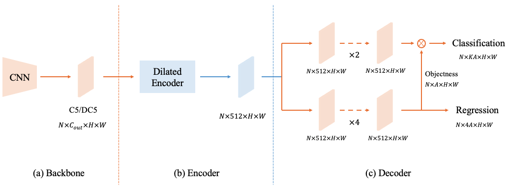

# You Only Look One-level Feature (YOLOF), CVPR2021
A simple, fast, and efficient object detector **without** FPN.

- This repo provides an implementation for YOLOF based on [cvpods](https://github.com/Megvii-BaseDetection/cvpods). A neat and re-organized 
Detectron2 version of YOLOF is available at [https://github.
com/chensnathan/YOLOF](https://github.com/chensnathan/YOLOF).

> [**You Only Look One-level Feature**](https://arxiv.org/abs/2103.09460),            
> Qiang Chen, Yingming Wang, Tong Yang, Xiangyu Zhang, Jian Cheng, Jian Sun



## Getting Started

- Install `cvpods` by following [the installation guidance](README_cvpods.md).
- Install `mish-cuda` to speed up the training and inference when using `CSPDarkNet-53` as the backbone (**optional**)
    ```shell
    git clone https://github.com/thomasbrandon/mish-cuda
    cd mish-cuda
    python setup.py build install
    cd ..
    ```
- Download the pretrained model to train with the [CSPDarkNet-53](https://1drv.ms/u/s!AgM0VtBH3kV9imGxZX3n_TMQGtbP?e=YMgpGJ) backbone (**optional**)
    ```shell
    mkdir pretrained_models
    # download the `cspdarknet53.pth` to the `pretrained_models` directory
    ```
- Train
    ```shell
    cd playground/detection/coco/yolof/yolof.res50.C5.1x
    pods_train --num-gpus 8
    ```
- Test
    ```shell
    cd playground/detection/coco/yolof/yolof.res50.C5.1x
    pods_test --num-gpus 8 MODEL.WEIGHTS /path/to/checkpoint_file
    ```
  
## Main results

The models listed below can be found in [this onedrive link](https://1drv.ms/u/s!AgM0VtBH3kV9imGxZX3n_TMQGtbP?e=YMgpGJ). The FPS is tested on a 2080Ti GPU.
More models will be available in the near future.

| Model                                     |  COCO val mAP |  FPS  |
|-------------------------------------------|---------------|-------|
| YOLOF_R_50_C5_1x                          |  37.7         |   32  |
| YOLOF_R_50_DC5_1x                         |  39.2         |   20  |
| YOLOF_R_101_C5_1x                         |  39.8         |   21  |
| YOLOF_R_101_DC5_1x                        |  40.5         |   15  |
| YOLOF_CSP_D_53_DC5_3x                     |  41.2         |   39  |


## Citation

If you find this project useful for your research, please use the following BibTeX entry.

    @inproceedings{chen2021you,
      title={You Only Look One-level Feature},
      author={Chen, Qiang and Wang, Yingming and Yang, Tong and Zhang, Xiangyu and Cheng, Jian and Sun, Jian},
      booktitle={IEEE Conference on Computer Vision and Pattern Recognition},
      year={2021}
    }